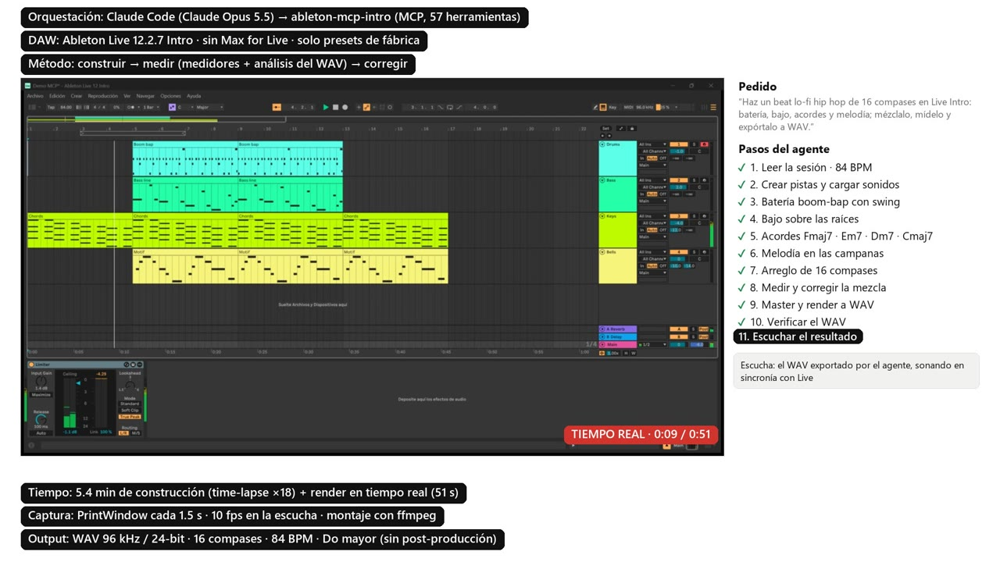
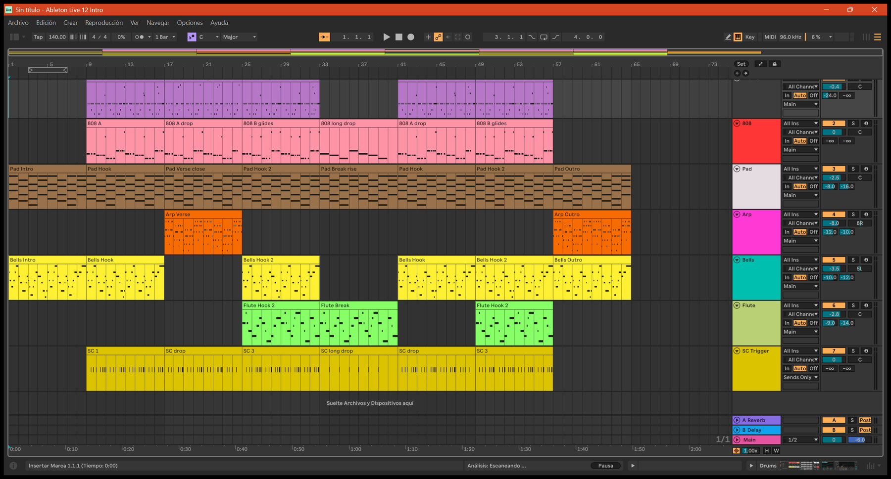
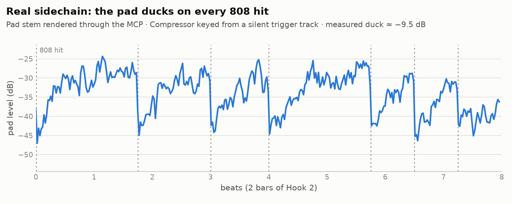
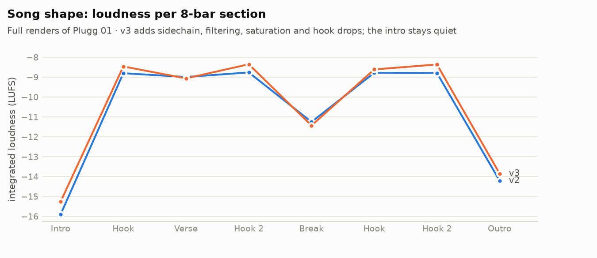
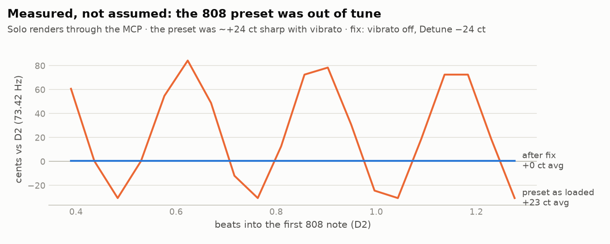
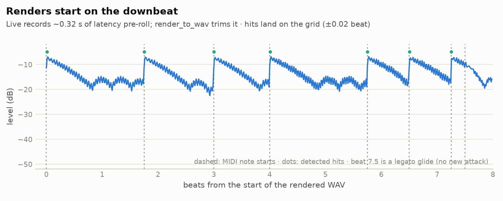

# Results: what was made through the MCP

Everything here comes from **real renders made by controlling Ableton Live 12 Intro through this bridge**. Nothing is hand-edited: [`build_examples.py`](build_examples.py) cuts the audio excerpts from the renders, draws the charts from measurements of those same files, and saves `analyze_audio`'s own output. The full-length WAVs (62 MB each) stay out of the repo.

The track is *Plugg 01*, a 64-bar Plugg / Cloud Trap beat at 140 BPM in A major. It was built, mixed, mastered and exported by an agent, with every decision checked by measurement. Stems aren't published because they would expose Ableton's library samples in isolation.

## Video: a lo-fi beat built from an empty set

▶ [**demo_lofi_beat_build.mp4**](video/demo_lofi_beat_build.mp4) (1:18, 9 MB, captions in Spanish). A separate test: Claude Code, using only the MCP tools, builds a 16-bar lo-fi hip hop beat (84 BPM) in an empty Live Intro set. It creates the tracks, writes drums, bass, chords and melody, arranges them, measures the mix, fixes what was clipping, and exports the WAV. The video is a time-lapse of the 5.4 real minutes of building, followed by the exported WAV playing in sync with Live.

Two moments worth noting: the first drum kit it loaded ("LDre Cafe Kit") hides its pads, so it switched to one that exposes them instead of guessing notes. And the first level check showed the master clipping (peak 0.935 against the 0.917 ceiling) with the keys masking the drums, so it rebalanced before exporting. Result: −14.3 LUFS, −1.02 dBTP, no clipping. Live was captured with `PrintWindow` every 1.5 s (never stealing focus), and the video was assembled with ffmpeg.

## Plugg 01

*The set as the agent left it: 64 bars, top to bottom Drums (purple), 808, Pad, Arp, Bells and Flute, plus the silent "SC Trigger" track that keys the sidechain. Clip names show the arrangement moves ("808 A drop", "Pad Verse close", "Pad Break rise"). The capture was taken through the bridge (Arrangement view, browser hidden, zoomed to the whole song).*

## Listen

| | |
|---|---|
| 🎧 [**Plugg 01 v3, 27 s excerpt**](audio/plugg01_v3_excerpt.mp3) | Verse into Hook 2, from the final master (−9.8 LUFS, −1.0 dBTP) |
| 🎧 A/B at the Hook 2 entrance: [**v2**](audio/ab_hook2_entrance_v2.mp3) · [**v3**](audio/ab_hook2_entrance_v3.mp3) | Same 8 bars. v3 adds real sidechain, high-pass/air EQ, tape-style saturation and an 808 drop before the hook. Measured entrance lift: **−1.5 LU → +5.0 LU** |
| 🎧 808 tuning: [**before**](audio/808_before_fix.mp3) · [**after**](audio/808_after_fix.mp3) | 2 bars of the solo 808. The preset shipped ~24 cents sharp with vibrato; the agent found it by measuring |

## See

<picture>
  <source media="(prefers-color-scheme: dark)" srcset="img/sidechain_dark.png">
  
</picture>

**Real sidechain.** A Compressor keyed from a silent "ghost trigger" track that mirrors the 808 notes. The pad dips on every hit (dashed lines).

<picture>
  <source media="(prefers-color-scheme: dark)" srcset="img/loudness_by_section_dark.png">
  
</picture>

**Song shape.** Loudness per 8-bar section. The intro stays around −15 LUFS, the hooks around −8.4, and the break drops to −11.4. Data: [`data/loudness_by_section.json`](data/loudness_by_section.json) (v1 is within 0.6 LU of v2 and is left out of the chart).

<picture>
  <source media="(prefers-color-scheme: dark)" srcset="img/808_tuning_dark.png">
  
</picture>

**Measured, not assumed.** Pitch of the first 808 note, in cents from D2. The preset as loaded averaged +23 cents with a ±50-cent vibrato. After the fix (vibrato off, Detune −24 cents) it measures +0.9.

<picture>
  <source media="(prefers-color-scheme: dark)" srcset="img/render_alignment_dark.png">
  
</picture>

**Renders start on the downbeat.** Live records about 0.32 s of latency pre-roll; `render_to_wav` trims it. The detected hits land on the MIDI grid within ±0.02 beat.

## Read

- [**EXAMPLE_SESSION.md**](EXAMPLE_SESSION.md): a condensed real exchange ("add sidechain and make it more dynamic"). It shows the tool calls, the measurements, and a mistake the agent caught by measuring.
- [**data/analyze_audio_plugg01_v3.json**](data/analyze_audio_plugg01_v3.json): `analyze_audio`'s actual output for the final master (loudness, true peak, band balance, stereo, texture, per-section loudness).
